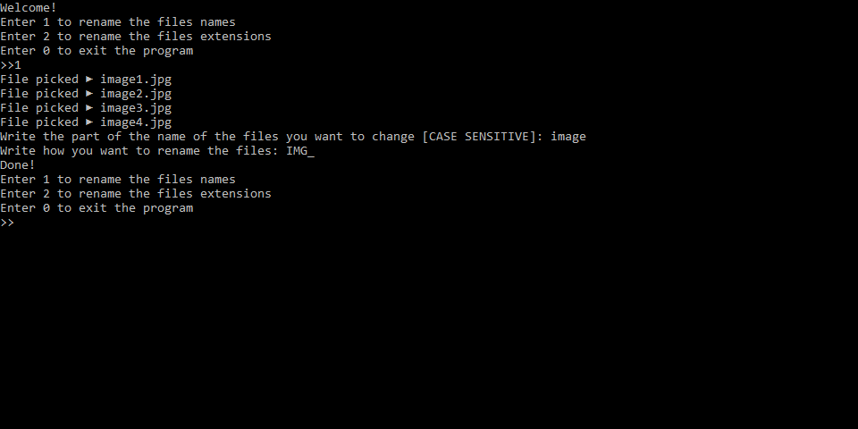
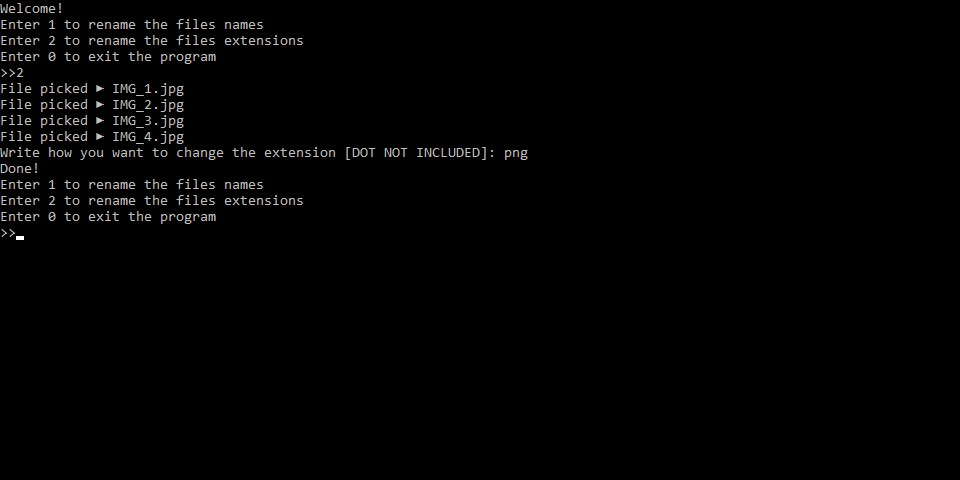

# BulkRenamer

## Simple Python program to rename in bulk files names or files extension

## Requirements for Linux
```
$ sudo apt-get install python3-tk
```

## Installation
```
$ git clone https://github.com/AbsurdUsername/BulkRenamer.git
```

## Usage on Linux
```
$ cd BulkRenamer
$ python3 BulkRenamer.py
```

## Usage on Windows
```
> cd BulkRenamer
> BulkRenamer.py
```
### Alternatively

Download the latest release [here](https://github.com/AbsurdUsername/BulkRenamer/releases/)

### Or build it yourself
```
$ pip install pyinstaller
$ pyinstaller [-F] [-i icon.ico] BulkRenamer.py
```

### Rename the files names
1. Select the files you want to change the name
2. Write the part of the name you want to change
3. Write how you want to rename the files
4. Done



### Rename the files extensions
1. Select the files you want to change the extension
2. Write how you want to change extension
3. Done


